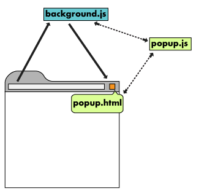

# Chrome Browser Extensions: An introduction

This post aims to serve as a starting point for people who want to start building Chrome Extensions, it will help you learn what they are, why and how you may want to use them. It comes with a [Chrome Extension Template](https://github.com/edrpls/chrome-extension-template) to get you up and running.

This post also exists in presentation form, as an effort of GumGum's JavaScript Guild, a group of coworkers who get together to discuss and share all things JavaScript.

[YOUTUBE EMBED HERE]

## What is an extension?

A browser extension is a plug-in that allows the user to customize the browing experience.

In the case of Chrome, these plug-ins are delivered as bundle in the form of a zip file with a `.crx` extension.
They may contain HTML, CSS, and/or JS files, as well ass static assets like images, fonts, or other media.

They must be explicitly installed and approved by the user.

### Why use an extension?

Extensions allow us to modify web content in ways a regular JavaScript file loaded from a website cannot; that is, to **extend** the behavior of a page or webapp.

A few examples of what extensions can do:

- Setting bookmarks on behalf of the user
- Running global timers,
- Saving a page as HTML or image.
- Interacting with the Accessibility Object Model
- Accessing system files
- Identifying users by OAuth2 credentials
- Adding an icon, tooltip, badge, and popup to the toolbar.
- Using keyboard shortcuts that trigger actions.
- Adding items to Google Chrome's context menu.
- Create a version of the New Tab, Bookmark, or History pages.
- Dynamically display icons in the toolbar.

## Architecture

An extension's architecture will depend on its functionality. A robust extension will usually include:

- Manifest file
- Background Script
- UI Elements
- Content Scripts
- Options Page

Simple extensions may not use all parts of this architecture; the only required file is the manifest.

### manifest.json

A JSON file that specifies the configurations and permissions needed, as well as what files should be allowed by the browser.
Assets needed by the extension must be specified here, otherwise, **will not be loaded** into the browser! This file is required in all extensions.

Display icons and the extension's description are also specified here; an extension **must have at least one icon**.

#### Permissions

The manifest controls all the permissions that the extension will be granted, if a feature you need is not specified here, it won't be usable by your extension.

Some of the permissions include:

- On which URLs should the extension load?
- What scripts are allowed?
- What tabs can be accessed?
- What external resources are allowed?
- Is the use of eval() allowed in the code?

#### Example

The following configuration, is an example of a configuration used for an internal GumGum extension. Explanation after the file.

By the way, releasing an extension to the public requires the code to go through Google's review process, things like minification are not allowed by them, since it obfuscates the code and could hide the intent of the code.

Publishing an internal extension for an organization, like in this case, avoids this process, meaning we can build anything to be used inside the organization.

```json
{
  "manifest_version": 2,
  "name": "GumGum Screenshots",
  "version": "0.2.1",
  "description": "Insert GumGum ads anywhere!",
  "icons": {
    "16": "16x16.png",
    "48": "48x48.png",
    "128": "128x128.png"
  },
  "browser_action": {
    "default_title": "GumGum Screenshots",
    "default_popup": "popup.html"
  },
  "content_scripts": [
    {
      "matches": ["<all_urls>"],
      "css": ["inContent.css"],
      "js": ["inContent.js"]
    }
  ],
  "content_security_policy": "script-src 'self' 'unsafe-eval'; object-src 'self'; img-src * data: 'self' 'unsafe-eval'",
  "offline_enabled": true,
  "permissions": ["tabs", "<all_urls>", "activeTab"],
  "web_accessible_resources": [
    "injector.js",
    "https://g2.gumgum.com",
    "https://s3.amazonaws.com/js-dev.gumgum.com",
    "https://js.gumgum.com/gumgum.js",
    "inContent.css",
    "hintBar.html"
  ]
}
```

Some of the properties of the manifest like the name, description, version, and thumbnails will be used directly to display information to the user.

Others, will be used to specify what files should load where, for example, in this case, the `browser_action` property specifies that clicking on the extension's icon in the browser, should open a popup, other extensions may open a background page or just run a script.

The `content_scripts` property specifies that our CSS and JS files named `inContent` should be loaded on ALL URLs.

Files can be referred to by their relative path, or an [absolute URL provided by the chrome API](https://stackoverflow.com/a/7645775/1335287).

The `content_security_policy` section helps allowing or blocking certain actions, for example, use of 'eval' is disallowed by default, but extensions compiled with some bundlers like webpack might need eval to work. We also specify what sources are allowed for our images, in this case, images can come either from data-urls or external sources.

Then we specify that our extension should be usable even offline.

On the `permissions` section, we ask for access to tabs, to load our extension on any URL, and to access the active tab.

Next we specify what resources should be accessible by the content scripts, in this case, we have a custom file used to insert GumGum's content. Then a list of URLs we may need to contact, and even CSS or HTML files.

### Background script

This script can communicate between different parts of the extension, for example, opening a popup may trigger a listener to fire a server request. This script can listen for browser events that are relevant for the extension, and should lie dormant until an even activates it.

Not all extensions need of a background script

### UI Elements



User interaction can happen in some UI elements like a popup which can contain HTML and additional JavaScript logic, it can even be an application itself, from a full React app to something lighter like [HyperApp](https://github.com/jorgebucaran/hyperapp) or just vanilla JS.

The extension's User Interface, should be purposeful and minimal.

Most extensions have browser or page actions, but they can contain other UI elements like:

- Context menus
- Use the omnibox
- Create keyboard shortcuts
- Customize page styles

### Content Scripts


This is the only script that executes in the context of the web page, it has access to the active tabs document, but not the window object. Extensions that need to read or modify a tab's content dynamically, will use a content script.

Since it has no access to the window object, communication with it can happen via messaging.

### Content Scripts Messaging


Content scripts communicate with the extension by exchanging messages and storing values using the storage API.

We'll see some examples later in this post.

### Options Page

The options page allows customizing the extension even further if necessary, allowing user input that can be persistent across pages and sessions. Not all extensions will need an Options page

## Chrome APIs

In addition to the APIs you normally use on a webpage, extensions can also use extension-specific APIs to _extend_ interaction with the browser.

Most Chrome APIs are asynchronous and receive a callback function to handle results.

```javascript
//THIS CODE DOESN'T WORK
var tab = chrome.tabs.query({ active: true }); //WRONG!!!
chrome.tabs.update(tab.id, { url: newUrl });

//THIS CODE WORKS
chrome.tabs.query({ active: true }, function(tabs) {
  chrome.tabs.update(tabs[0].id, { url: newUrl });
});
```

### Communication between pages

Different parts of an extension can communicate either with `chrome.extension` methods or window messaging.

##### Accessing other script's methods:

```javascript
// background.js
const backgroundVar = "Hi from BG!";

function someBackgroundFn() {
  console.log(backgroundVar);
}

// popup.js
const backgroundWindow = chrome.extension.getBackgroundPage();
backgroundWindow.someBackgroundFn(); // 'Hi from BG!'
```

Here we are asking Chrome for the background page, which returns the global window object for background.js so that we can later access methods of this window easily.

##### Short lived window messaging

Communication can have a short life, by sending a message between scripts.

A message can have any value, in this case, our whole message is an object that contains a single propert `code`, but a message could take any shape you need.

```javascript
// popup.js
/* message listener */
chrome.runtime.onMessage.addListener(message => {
    /* handle mesages from other pages */
}

/* Send a message on extension runtime */
const message = { code: "sendRequest };
chrome.runtime.sendMessage(message);

// background.js
/* a random function */
const callEndpoint = () => { /* etc */ };

/* listen for a message with the code "sendRequest" */
chrome.runtime.onMessage.addListener(message => {
    if (message.code === "sendRequest") {
        callEndpoint();
    }
})
```

##### Long lived window messaging

Sometimes a short message is not enough, we may need to open a connection between scripts, for example, if we want to detect one of the scripts closing the connection (ie. A popup closing).

We open a `port` in order to keep a long lived connection:

```javascript
// popup.js

/* Open port on popup file */
const port = chrome.runtime.connect({
    name: "aCustomExtensionPortName"
});

/* Listen for messages on the port */
port.onMessage.addListener(message => {
    /* handle mesages from other pages */
})

/* Send a message throught the port */
port.postMessage({
    code: "sendRequest"
});

// background.js

const callEndpoint = fetch(/*...*/);

/* Connect to the extension's port and listen to messages */
chrome.runtime.onConnect.addListener(port => {
    port.onMessage.addListener(message => {
        /* Perform an action if ther message meets our criteria */
        if (message.code === "sendRequest") {
            callEndpoint();
        }
    }
}
```

### Storing data

Extensions can use Chrome's storage API or the HTML5 web storage API, as well as sending server requests to persist data elsewhere.
This is not that different from how you would usually store data. There is a 5MB limit to be aware of, but should be more than enough for most extensions.

While on incognito mode, extensions should not store data:

```javascript
function saveTabData(tab) {
  if (tab.incognito) {
    return;
  } else {
    chrome.storage.local.set({ data: tab.url });
  }
}
```

## Conclusion

Building a Chrome Extension is not that different from building other kinds of JavaScript applications, with some differences on browser specific APIs and even new API's that allow us to customize the user experience further.

Extensions have many different and varied applications, because of it, not all extensions need the same permissions, or even the same types of files. Some extensions can do things as simple as modifying page styles, others can be complex enough to be considered apps.

While extensions provide open up a lot of posibilities to solve different problems, they are not without their drawbacks: the need for the user to install them into the browser and grant permissions, may put off some people, also, having to fulfill all of Google's [requirement's for publishing in the Chrome Store](https://developer.chrome.com/webstore/publish) can take time while waiting for reviews and the next iterationof the extension.

Despite this, extensions have a place and are great to solve specific problems that JavaScript delivered through a site cannot.

## External links

[Chrome Extension Template](https://github.com/edrpls/chrome-extension-template): a boilerplate repo that you can use as a starting point to build Chrome Extensions, it includes common scenarios of communication between scripts.

[Sample Chrome Extension](https://github.com/edrpls/social-network-alert) built with the template.

[MDXs slides](https://github.com/edrpls/chrome-extensions-what-why-how) used for GumGum's JS Guild presentation.
