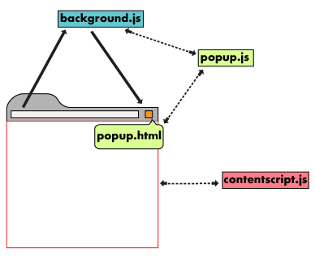
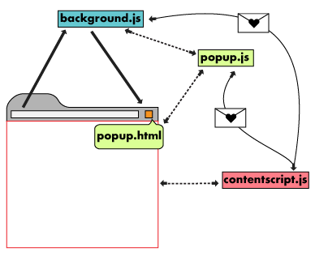

export { swiss as theme } from 'mdx-deck/themes'


# Chrome Browser Extensions
### What? Why? How?
By Eder Sanchez

```notes
Today we'll talk about what is a Chrome extension and why you may want to use them.
```

---
## What?

A zip bundle of HTML, CSS, JS, etc used in the web browser to customize the browsing experience.

---
## Why?

Extensions allow us to modify web content; to change or extend the behavior of a browser, webpage or webapp.

Do things you normally can't with JavaScript alone.

```notes
Set bookmarks, run global timers, save a page as HTML, access the Accessibility Object Model, access system files, identify users by OAuth2 credentials and much more!
```

---
# Architecture

An extension's architecture will depend on its functionality. A robust extension will usually include:

* Manifest
* Background Script
* UI Elements
* Content Scripts
* Options Page

```notes

Simpler extensions might skip different parts of this architecture, except for the manifest. But other elements are not strictly necessary.
```

---
## Architecture: manifest.json

Specifies configurations and more:

* All extensions **require** this file!
* Extensions must have an icon!
* Which files should be loaded and where
* What thumbnails to use
* Extension description
* Permissions

```notes
This file can be seen as the configuration file, nothing happens without it being on the manifest, for example, if a script is not specified in the manifest, it won't be loaded into a tab.
```

---
### manifest.json: Permissions

* On which URLs should the extension be loaded?
* What scripts are allowed?
* What tabs can be access?
* What external resources are allowed?

```notes
The manifest also controls all the permissions that the extension will be able granted, and the user must grant these permissions.

Permissions include: **see slide**
```

---
### manifest.json: A real world example (pt 1)

```json
{
    "manifest_version": 2,
    "name": "GumGum Screenshots",
    "version": "0.2.1",
    "description": "Insert GumGum ads anywhere!",
    "icons": {
        "16": "16x16.png",
        "48": "48x48.png",
        "128": "128x128.png"
    },
    "browser_action": {
        "default_title": "GumGum Screenshots",
        "default_popup": "popup.html"
    },
    "content_scripts": [
        {
            "matches": ["<all_urls>"],
            "css": ["inContent.css"],
            "js": ["inContent.js"]
        }
    ],
```
Continues in next slide...

```notes
Some of the properties of the manifest will be shown directly to the user, like the name, description, version, and thumbnails.

Others, will be used to specify what files should load where, for example, in this case, the `browser_action` property specifies that clicking on the extension's icon in the browser, will open a popup, other extensions may open a background page or just run a script.

Then at the bottom, the `content_scripts` property specifies that our CSS and JS files named `inContent` should be loaded on ALL URLs.

Files can be referred to by their relative path, or an absolute URL using the extension ID.
```

---
### manifest.json: A real world example (pt 2)

```json
    "content_security_policy":
        "script-src 'self' 'unsafe-eval'; object-src 'self'; img-src * data: 'self' 'unsafe-eval'",
    "offline_enabled": true,
    "permissions": ["tabs", "<all_urls>", "activeTab"],
    "web_accessible_resources": [
        "injector.js",
        "https://g2.gumgum.com",
        "https://s3.amazonaws.com/js-dev.gumgum.com",
        "https://js.gumgum.com/gumgum.js",
        "inContent.css",
        "hintBar.html"
    ],
    "update_url": "http://0.0.0.0"
}

```

```notes
The `content_security_policy` section allows of blocks certain actions, for example, use of 'eval' is disallowed by default, but scripts compiled with some bundlers might need eval to be allowed.

Here we also specify what sources are allowed for our images, here we allow all.

Then we specify that our extension should be usable even offline.

On the permissions sections, we ask for access to tabs, to load our extension on any URL, to access the active tab.

Next we specify what resources should be accessible by the content scripts, in this case, we have a custom file used to insert ads and gumgum's creative wrapper. Then a list of URLs we might need to contact, and even css or html files.

At the bottom, we have a URL that specifies autoupdating, it is not necessary if the extension is published on the Chrome dashboard.

Quick note on that, releasing an extension to the public requires the code to go through Google's review process, things like minification are not allowed by them, since it obfuscates the code and could hide the intent.

Publishing an internal extension for an organization, like the Screenshots or Switcheroo Plus extensions, skips this process, meaning we can build anything inside the organization. EVEN SOMETHING EVIL.

But I digress.
```

---
## Architecture: Background script

Handles the extension's events, contains listeners for browser events that are relevant for the extension.

Should be dormant until an event is fired.

```notes
This script can communicate between different parts of the extension, for example, opening the popup may trigger a listener to fire a server request, then, user interaction with a button inserted to a page, could fire another request on the background script.

Not all extensions need of a background script
```

---
## Architecture: UI Elements

The extension's User Interface, should be purposeful and minimal.

Most extensions have browser or page actions, but they can contain other UI, like context menus, use of the omnibox or creating keyboard shortcuts.


```notes
Extension UI pages, like the popup can contain HTML and additional JavaScript logic, it can even be an application in itself.
The Screenshots extension was built using a 1KB framework called hyperapp, but it can be practically anything you want, even that crazy vanilla JS framework.
```

---
## Architecture: Content Scripts


Extensions that read or write to web pages use a content script.

This is the only script that executes in the context of the web page



```notes
This is the only script with access to the main object window.
```

---
## Architecture: Content Scripts Messaging

Content scripts communicate with the extension by exchanging messages and storing values using the storage API.




```notes
We'll see how to send messages later.
```

---
## Architecture: Options Page

The options page is an optional page that helps customizing the extension even further if it is relevant for the extension

```notes
Not all extensions need of an Options page
```

---
# Chrome APIs

In addition to the APIs you normally use on a webpage, extensions can also use extension-specific APIs to extend interaction with the browser.

Most Chrome APIs are asynchronous and receive a callback function to handle results.

```javascript
//THIS CODE DOESN'T WORK
var tab = chrome.tabs.query({'active': true}); //WRONG!!!
chrome.tabs.update(tab.id, {url:newUrl});

//THIS CODE WORKS
chrome.tabs.query({'active': true}, function(tabs) {
    chrome.tabs.update(tabs[0].id, {url: newUrl});
});
```

```notes
I like to wrap these methods around a promise to have a more modern layer, but this is the main idea behind the async methods.
```

---
# Communication between pages

Different parts of an extension can communicate with chrome.extension methods or by window messaging.

```javascript
// background.js
function someBackgroundFn () {
    /* Do something here */
}

// popup.js
const backgroundWindow = chrome.extension.getBackgroundPage();
backgroundWindow.someBackgroundFn();
```

```notes
This way we can access other window objects.
```

---
# Short lived window messaging
```javascript
// popup.js
chrome.runtime.onMessage.addListener(message => {
    /* handle mesages from other pages */
}

chrome.runtime.sendMessage({
    code: "sendRequest"
});

// background.js
const callEndpoint = () => { /* etc */ };

chrome.runtime.onMessage.addListener(message => {
    if (message.code === "sendRequest") {
        callEndpoint();
    }
})
```

```notes
Here we set message listeners in scripts that may need to handle messages from other windows.
```

---
# Long lived window messaging
```javascript
// popup.js
const port = chrome.runtime.connect({
    name: "aCustomExtensionPortName"
});

port.onMessage.addListener(message => {
    /* handle mesages from other pages */
})

port.postMessage({
    code: "sendRequest"
});

// background.js
chrome.runtime.onConnect.addListener(port => {
    port.onMessage.addListener(message => {
        if (message.code === "sendRequest") {
            callEndpoint();
        }
    }
}
```

```notes
Here a port is open to listen for messages specific to it.
```

---
# Storing data

Extensions can use Chrome's storage API or the HTML5 web storage API, as well as sending server requests to persist data elsewhere.

While on incognito mode, extensions should not store data:

```javascript
function saveTabData(tab) {
    if (tab.incognito) {
        return;
    } else {
        chrome.storage.local.set({data: tab.url});
    }
}
```

```notes
This is not that different from how you would usually store data. There is a 5MB limit to be aware of, but should be more than enough for most extensions.
```

---
# On to the demo...
